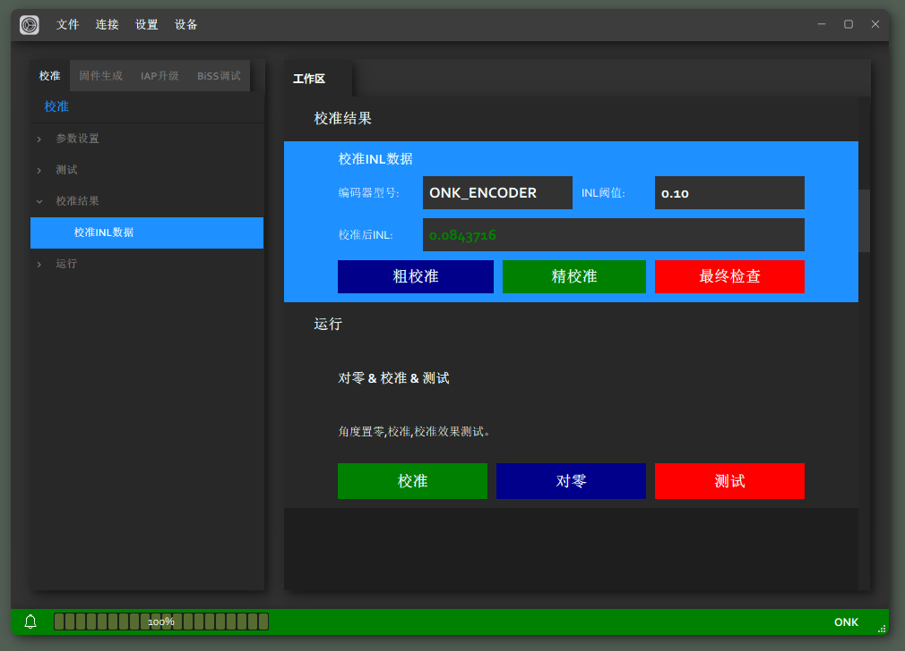

<!--   -->
 

# ***ControlerHost*** **使用手册**  
- [***ControlerHost*** **使用手册**](#controlerhost-使用手册)
  - [适用范围](#适用范围)
  - [主要特性](#主要特性)
  - [安装环境](#安装环境)
  - [硬件环境](#硬件环境)
  - [安装方式](#安装方式)
  - [功能详述](#功能详述)
    - [标题栏](#标题栏)
    - [导航栏\&工作区](#导航栏工作区)
      - [校准对零](#校准对零)
      - [固件生成](#固件生成)
      - [IAP升级](#iap升级)
      - [BiSS调试](#biss调试)
    - [状态栏](#状态栏)
    - [特别说明](#特别说明)

## 适用范围

- [ONK-深圳欧诺克科技有限公司](https://www.sz-onk.com/) `LME` 系列编码器;
- [ONK-深圳欧诺克科技有限公司](https://www.sz-onk.com/) `AbsReslover` 旋变解析卡;
- [ONK-深圳欧诺克科技有限公司](https://www.sz-onk.com/) `BiSS-Master` 调试板；
- [ONK-深圳欧诺克科技有限公司](https://www.sz-onk.com/) `Calibration Controler` 校准工装；

## 主要特性  

- 支持 `LME` 系列编码器[校准调零](#校准对零)； 
- 支持 `LME` 与 `AbsReslover` [参数配置与调试](#biss调试);
- 支持 `LME` 、 `AbsReslover`、 `BiSS-Master` 、`Calibration Controler`系列产品[固件升级](#iap升级)；

## 安装环境

- 系统 `Windows x64` / `Windows x86`;
- 串口驱动[CH340/CH341](https://www.wch.cn/downloads/CH341SER_EXE.html);
  
## 硬件环境

- 对`LME`编码器的[校准调零](#校准对零)： 需要配备[ONK-深圳欧诺克科技有限公司](https://www.sz-onk.com/) `Calibration Controler` 校准工装；
- 对 `LME` 与 `AbsReslover` [参数配置与调试](#biss调试)： 需配备[ONK-深圳欧诺克科技有限公司](https://www.sz-onk.com/) `BiSS-Master` 调试板;
- 对 `LME` 与 `AbsReslover` [固件升级](#iap升级)： 需配备[ONK-深圳欧诺克科技有限公司](https://www.sz-onk.com/) `BiSS-Master` 调试板;

## 安装方式

- 在线安装方式：[在线安装包下载地址](https://hsguy-y.github.io/ONK_Release/ControlerHost/install/onk_controlerhost_online_install.exe);
- 离线安装方式：[离线安装包下载地址](https://hsguy-y.github.io/ONK_Release/ControlerHost/install/onk_controlerhost_offline_install.exe);

## 功能详述

- *详细介绍此应用的各项功能，操作方式。*

### 标题栏

1. ***文件*** 

      - *文件选项卡，主要提供对 `.bin` 文件的`新建`、`打开`、`修改`、`保存`等操作。* 

      - ***打开 `.bin` 文件；*** 
        - ***点击 `文件` -> `打开固件`*** 
           
        - ***选择 `.bin` 文件；*** 
           
        - ***浏览或编辑 `.bin` 文件。*** 
           
      - ***保存 `.bin` 文件*** 
        - ***点击 `文件` -> `保存`（<kbd>Ctrl</kbd> + <kbd>S</kbd>）或 `文件` -> `另存为`（<kbd>Ctrl</kbd> + <kbd>Shift</kbd> + <kbd>S</kbd>）均可保存文件。***  
           

2. ***连接*** 

    - *连接选项卡，可用于不同设备的`链接`操作。* 

    - ***点击 `连接` -> `串口`；*** 
         
    - ***选择 `串口号` 、 `波特率` 、`设备型号`；*** 
         
    - ***成功连接`指定设备`；*** 
         

3. ***设置*** 
   
   1. ***权限设置*** 
    
       - *本软件通过用户权限不同提供不同的功能选项；* 
         *权限角色分为：<kbd>用户</kbd>、<kbd>调试员</kbd>、<kbd>管理员</kbd>；* 
       - ***可通过标题栏中 `设置` -> `权限设置` 中修改用户权限。*** 
             
       - ***选择权限 `用户` ，输入 [密码]()*** 
             
       - ***切换至`用户权限`*** 
             

   2. ***语言设置*** 
   
       - *应用支持多种语言切换。注意：（语言切换均基于<kbd>中文机翻</kbd>）；* 

       - ***可通过标题栏中 `设置` -> `语言设置` 中修改语种*** 
             
       - ***选择语言 `英文`，点击`确认`*** 
             
       - ***切换至`英文页面`*** 
             

4. ***设备*** 
   
   - *设备选项卡，用于拓展`新设备`，添加新设备参数以适配程序功能<mark>（用户权限下无法使用）</mark>。* 
   - ***点击 `设备` -> `添加设备`；*** 
         
   - ***添加 `设备参数`;*** 
         
   - ***添加成功,可在 `设备类型` 中找到添加的设备 `onk_test001`；*** 
         

### 导航栏&工作区
   - *导航栏包含应用各项功能的`导航目录`；其与工作区各项功能项相互  连接，可通过点击目录导航至对应`功能选项`。*
#### 校准对零
   - *此功能页可控制校准工装 `Calibration Controler` 完成对 `LME` 系列绝对值磁编码器的 `校准补偿功能` ，以校准由安装误差导致的非线性误差，确保编码器读数的精准度；在校准完成后 `INL` 非线性误差会降低至`0.1°` 以下。 *
   - *同时可通过对零驱动器向电机给定零点锁止电流，通过 `Calibration Controler` 的 `对零功能`，设置为出厂指定的 `零点偏移` 。*
   - *`差速测试` 将按照指定的不同转速旋转，计算不同转速下编码器 `INL` 误差表现，用以验证校准效果。*
   - ***硬件连接***
     - *调试电脑 `Computer` 与校准工装 `Calibration Controler` 通过 `USB2.0 Type A To USB2.0 Type B` 连接线连接；* 
           
     - *待校准电机编码器 `LME` 与校准工装 `Calibration Controler` 通过 `DP15` 连接线连接；* 
           
     - *待校准电机 `Moter`  与校准工装 `Calibration Controler` 通过连轴器连接，且电机 `UVW` 供电线<mark>请勿短接</mark>。* 
           
     - *测试连接是否成功，点击 `连接` -> `串口`；*
           
     - *选择对应具有 `CH340` 标识的串口号；若无法识别，请确保电脑已经安装[CH340驱动](https://www.wch.cn/downloads/CH341SER_EXE.html)后，逐一检查硬件连接状态。设置波特率为： `115200` ,设备型号： `CALIBRATION`。*
           
           
     - *连接成功提示*
           
   - ***参数配置***
     - *对拖电机参数*
       - *`分辨率`： 对拖电机编码器线数，默认 `2048C/T` 。*
       - *`参考点数`: 每圈采样点数量，默认 `256` 。*
       - *`校准速度`： 校准时的速度，对于 `LME` 系列中使用 `MT6826S` 或 `MT6835` 的产品对拖速度应设置为<mark>1000rpm以上<mark>。*
           
     - *差速测试参数*
       - *为四次 `INL` 测试指定不同的转速。*
           
   - ***校准***
     - *参数设置完成后，点击 `校准`。<mark>注：确保工装与电机连接正常，连轴器锁紧，电机三相供电线无短接</mark>。*
           
     - *校准完成*
           
     - *校准结果*
           
     - *点击 `粗校准` 、`精校准` 、`最终检查`,可查看校准过程中的 `INL` 曲线变化*
           
           
           
   - ***差速测试***
     - *参数设置完成后，点击`测试`。<mark>注：确保工装与电机连接正常，连轴器锁紧，电机三相供电线无短接</mark>。*
           
     - *测试完成*
           
     - *测试结果*
           
           
     - *测试过程中的 `INL` 曲线变化*
           
   - ***对零***
     - *在驱动器给定零点力矩后,点击 `对零` 按钮*
           
     - *对零结果*
           
#### 固件生成
- *此功能页用于生成 `LME` 、 `AbsReslover` 、 `BiSS-Master` 、 `Calibration Controler` 等产品的 `出厂固件` 及 `升级固件` 的合成<mark>（仅管理员权限可用）</mark>。*
- ***参数配置***
- ***固件生成***
#### IAP升级
- *此功能页用于对 `LME` 、 `AbsReslover` 、 `BiSS-Master` 、 `Calibration Controler` 等产品更新固件使用。 *
- *对于 `AbsReslover` 或 `LME` 产品中的`RS485`协议编码器的固件升级需搭配 [ONK BC系列驱动器](https://www.sz-onk.com/) 或 `BiSS-Master` 完成固件升级功能。*
- *对于 `LME` 系列产品中的 `BiSS-C` 协议编码器只能通过 `BiSS-Master` 完成固件升级功能。*
- ***硬件连接***
- 
- ***参数配置***
- ***固件升级***
#### BiSS调试
- *此功能页用于对 `LME` 系列编码器的通信调试、寄存器读写调试；另新增加 `BiSS` 与 `RS485` 协议切换功能，对`AbsReslover`新增加极对数修改功能。*
- ***硬件连接***
- ***参数配置***
- ***通信调试***
- ***寄存器读写***
- ***协议切换***
- ***极对数设置***
- ***`BiSS` 写零***
### 状态栏

*应用底部状态栏：包含`调试信息`显示按钮、`进度条`；用于提示耗时操作`进度`，以及程序`运行状态`。*

   - ***点击左下角 <kbd></kbd> 图标， 可打开`调试信息`窗口*** 
         
   - ***`调试信息`界面，再次点击左下角 <kbd></kbd> 图标，可隐藏`调试信息`窗口*** 
         
   - ***`错误`状态下`状态栏样式`*** 
     
   - ***操作`成功`状态下`状态栏样式`*** 
     

### 特别说明

 

