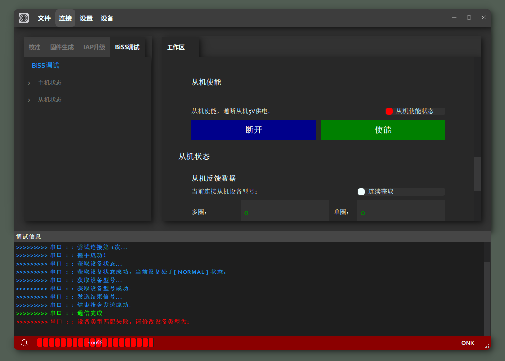
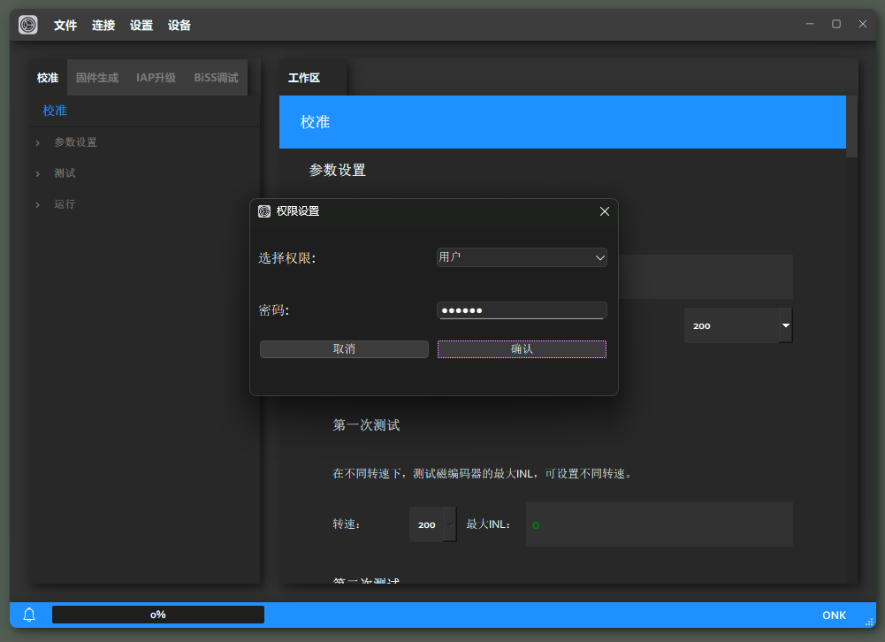

# ***ControlerHost*** **使用手册**  

## 适用范围
- [ONK-深圳欧诺克科技有限公司](https://www.sz-onk.com/) `LME` 系列编码器;
- [ONK-深圳欧诺克科技有限公司](https://www.sz-onk.com/) `AbsReslover` 旋变解析卡;
- [ONK-深圳欧诺克科技有限公司](https://www.sz-onk.com/) `BiSS-Master` 调试板；
- [ONK-深圳欧诺克科技有限公司](https://www.sz-onk.com/) `Calibration Controler` 校准工装；

## 主要特性  

- 支持 `LME` 系列编码器[校准调零](#校准调零)； 
- 支持 `LME` 与 `AbsReslover` [参数配置与调试]();
- 支持 `LME` 、 `AbsReslover`、 `BiSS-Master` 、`Calibration Controler`系列产品[固件升级]()；

## 安装环境
- 系统 `Windows x64` / `Windows x86`;
- 串口驱动[CH340/CH341](https://www.wch.cn/downloads/CH341SER_EXE.html);
  
## 硬件环境
- 对`LME`编码器的[校准调零](#校准调零)： 需要配备[ONK-深圳欧诺克科技有限公司](https://www.sz-onk.com/) `Calibration Controler` 校准工装；
- 对 `LME` 与 `AbsReslover` [参数配置与调试]()： 需配备[ONK-深圳欧诺克科技有限公司](https://www.sz-onk.com/) `BiSS-Master` 调试板;
- 对 `LME` 与 `AbsReslover` [固件升级](#固件升级)： 需配备[ONK-深圳欧诺克科技有限公司](https://www.sz-onk.com/) `BiSS-Master` 调试板;
## 安装方式
- 在线安装方式，[在线安装包下载地址](https://github.com/HSGUY-Y/ONK_Release/ControlerHost/install/onk_controlerhost_online_install.exe)
- 离线安装方式, [离线安装包下载地址](https://github.com/HSGUY-Y/ONK_Release/ControlerHost/install/onk_controlerhost_offline_install.exe)
## 页面展示

*BiSS调试页面：*  

## 功能详述
*详细介绍此应用的各项功能，操作方式。*
### 标题栏
1. ***文件*** 
   *文件选项卡，主要提供对 `.bin` 文件的`新建`、`打开`、`修改`、`保存`等操作。* 

2. ***连接*** 
   *连接选项卡，可用于不同设备的`链接`操作。* 

3. ***设置*** 
   
   1. ***权限设置*** 
    *本软件通过用户权限不同提供不同的功能选项;* 
    *权限角色分为：<kbd>用户</kbd>、<kbd>调试员</kbd>、<kbd>管理员</kbd>；* 
       - ***可通过标题栏中 `设置` -> `权限设置` 中修改用户权限。*** 
             
       - ***选择权限 `用户` ，输入 [密码]()*** 
             
       - ***切换至`用户权限`*** 
             

   2. ***语言设置*** 
    *应用支持多种语言切换。注意：（语言切换均基于<kbd>中文机翻</kbd>）；* 
       - ***可通过标题栏中 `设置` -> `语言设置` 中修改语种*** 
             
       - ***选择语言 `英文`，点击`确认`*** 
             
       - ***切换至`英文页面`*** 
             
4. ***设备*** 
   *设备选项卡，用于拓展`新设备`，添加新设备参数以适配程序功能。* 
### 导航栏&工作区
### 状态栏

 

# ***ControlerHost***

**目录(table of contents)**

### 校准调零

### IAP升级
### 固件生成 
### BISS调试
